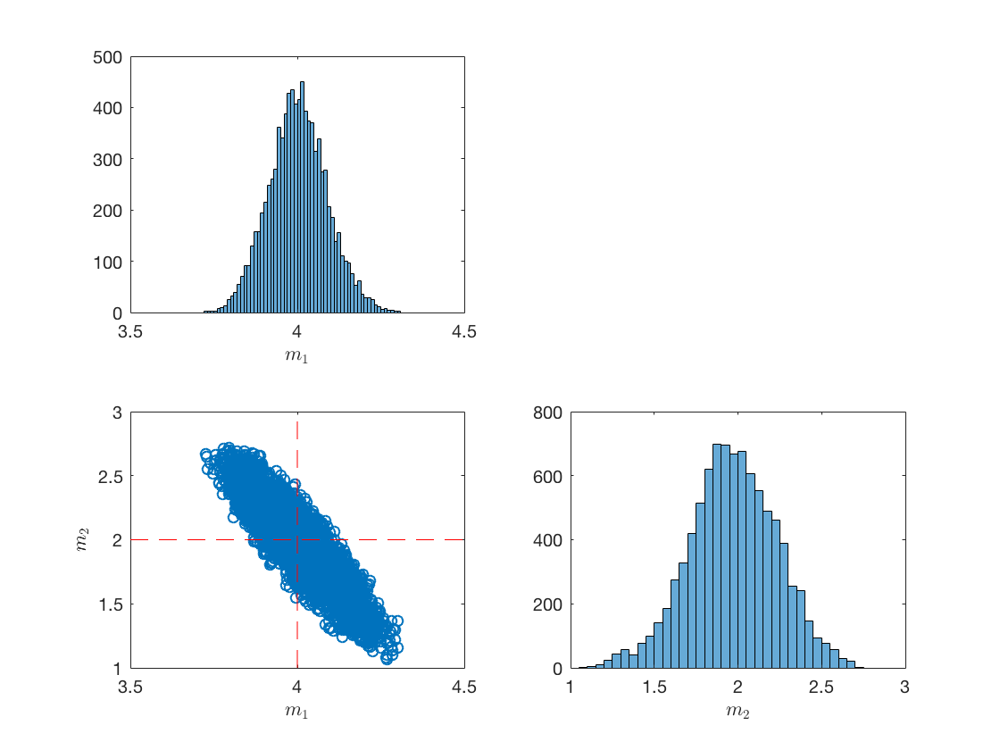

# mcmc_hmc
Hamiltonian/Hybrid Monte Carlo Sampling

This is the simple Hamiltonian sampling algorithm. The file hmc.m contains the
function and a simple example. The example
uses a simple forward model of the form dobs=m1*x+m2. Hamiltonian sampling is derivative based method and hence mostly applicable to continuous variable, however there are other methods involving discrete variable which are not covered here. 

After running the example you will see the posterior plotted something like below.

 
